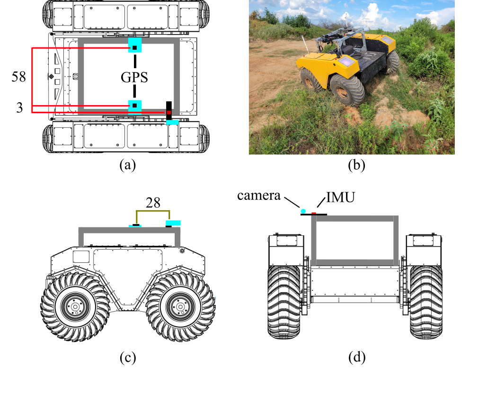
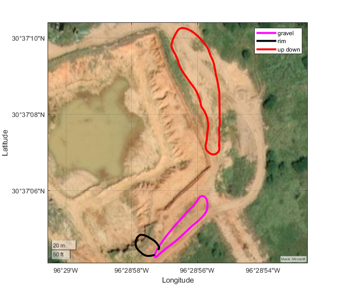

<h1>ROOAD: RELLIS Off-road Odometry Analysis Dataset</h1>

  George Chustz1 and Srikanth Saripalli1

  1. <a href="https://www.tamu.edu/">Texas A&M University; </a>

<a href="https://unmannedlab.github.io/research/ROOAD">[Website]</a> <a href="https://arxiv.org/abs/2109.08228">[Paper]</a> <a href="https://github.com/unmannedlab/ROOAD">[Github]</a> 

<a href="https://drive.google.com/file/d/1Zlky_363FPBKj7rcW59wKLcUGmP3hi9K/view?usp=sharing">[Download All]</a> <a href="#cite-us">[Cite Us]</a>

## Updates
9/15/2021 Initial release

## Overview
Localization is one of the fundamental problems in robotics. Visual Inertial Odometry is a set of algorithms which attempt to estimate the position and orientation of a subject using only camera(s) and an inertial measurement unit (IMU). We release the RELLIS Off-road Odometry Analysis Dataset to fill a void in available VIO datasets to provide high-quality, accurately time stamped off-road traversal data sequences for VIO researchers and developers. Across our data sequences, there is over **20,000 images**, **250,000 IMU readings**, and **6,000 RTK + heading measurements**.

### Data Collection Platform
[Clearpath Robotics Warthog](https://clearpathrobotics.com/warthog-unmanned-ground-vehicle-robot/)

### Sensor Suite

* [Basler Pylon Camera](https://www.baslerweb.com/en/products/cameras/area-scan-cameras/ace/aca1920-50gc/) - 1920x1200 @ 30FPS, PTP enabled
* [Vectornav VN300 IMU](https://www.vectornav.com/products/detail/vn-300) - 400 Hz, GPS denied
* [Ardusimple simpleRTK2B kit](https://www.ardusimple.com/rtk-starter-kits/) - 10 Hz, RTK GPS + heading

### ROS Bag

Data included in raw ROS bagfiles:

Topic Name | Message Type | Message Descriptison
------------ | ------------- | ---------------------------------
/pylon_camera_node/image_raw | sensor_msgs/Image | Images from the Basler Pylon Camera
/vectornav/IMU | sensor_msgs/Imu | Imu data from VectorNav-VN300
/UBX/hpposllh | [ubxtranslator](https://github.com/unmannedlab/ubxtranslator)/hpposllh | GPS data from the ground truth RTK GPS
/UBX/relpos2D | [ubxtranslator](https://github.com/unmannedlab/ubxtranslator)/hpposllh |

ROS bag download links:

rt4_calib  [6GB](https://drive.google.com/file/d/1IlHBodzK2GZYLctGTVceWP0uZ68y9hkt/view?usp=sharing)

rt4_gravel [8GB](https://drive.google.com/file/d/1dKx6_A1V4wN_0NTKCLrWYgIwozsVrO0F/view?usp=sharing)

rt4_rim    [5GB](https://drive.google.com/file/d/1m7y33UzYjT-1VgehGPSIzzcWltGRPb-N/view?usp=sharing)

rt4_updown [12GB](https://drive.google.com/file/d/1x-nKiURqvLhwyyHBCuPVEdS8MGo1VhOk/view?usp=sharing)

rt5_calib  [6GB](https://drive.google.com/file/d/19kQlU3PpkSEQdq1eZ4w7zs8GBo8p6jeO/view?usp=sharing)

rt5_gravel [7GB](https://drive.google.com/file/d/1NBq-YU0YYuI1-D8DxSXdBeoWQ9hCOfj0/view?usp=sharing)

rt5_rim    [5GB](https://drive.google.com/file/d/1sz33CuQ5rxQtYPe5DIpcOMTW9gpvu9Be/view?usp=sharing)

rt5_updown [10GB](https://drive.google.com/file/d/1Y1CjTEnbPadbg00uw0KLrydDc5-p9Cr0/view?usp=sharing)

## Cite Us
~~~text
@misc{chustz2021rooad,
      title={ROOAD: RELLIS Off-road Odometry Analysis Dataset}, 
      author={George Chustz and Srikanth Saripalli},      
      year={2021},      
      eprint={2109.08228},      
      archivePrefix={arXiv},      
      primaryClass={cs.RO}      
}
~~~

## License
All datasets and code on this page are copyright by us and published under the Creative Commons Attribution-NonCommercial-ShareAlike 3.0 License. 

## Related Work

[RELLIS-3D: A Multi-modal Dataset for Off-Road Robotics](https://github.com/unmannedlab/RELLIS-3D)

[A RUGD Dataset for Autonomous Navigation and Visual Perception inUnstructured Outdoor Environments](http://rugd.vision/)
