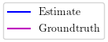
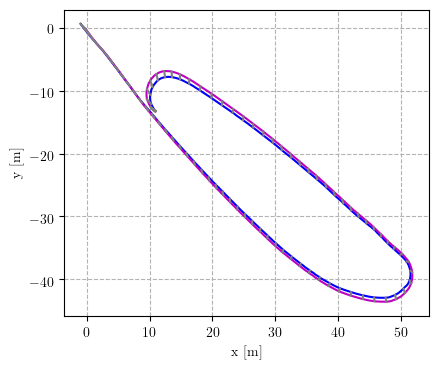
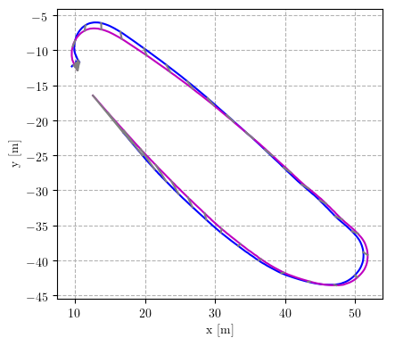
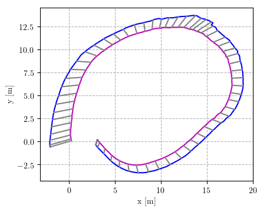
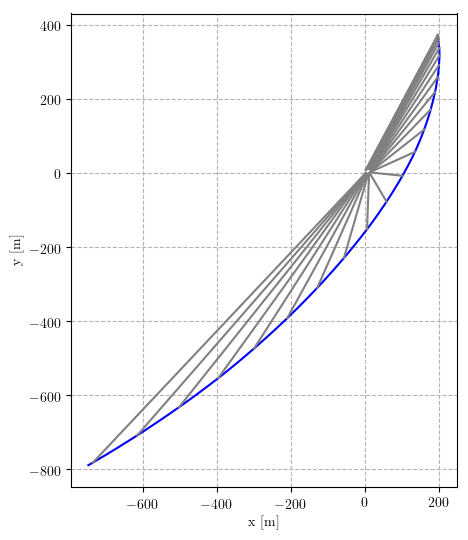
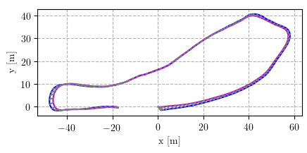
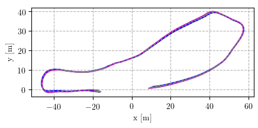

<h1>ROOAD: RELLIS Off-road Odometry Analysis Dataset</h1>

  George Chustz1 and Srikanth Saripalli1

  1. <a href="https://www.tamu.edu/">Texas A&M University; </a>

<a href="https://arxiv.org/abs/2109.08228">[Paper]</a> <a href="https://github.com/unmannedlab/ROOAD">[Github]</a> 

<a href="https://drive.google.com/file/d/1Zlky_363FPBKj7rcW59wKLcUGmP3hi9K/view?usp=sharing">[Download All]</a> <a href="#cite-us">[Cite Us]</a>

## Updates
9/15/2021 Initial release

## Overview
Localization is one of the fundamental problems in robotics. Visual Inertial Odometry is a set of algorithms which attempt to estimate the position and orientation of a subject using only camera(s) and an inertial measurement unit (IMU). We release the RELLIS Off-road Odometry Analysis Dataset to fill a void in available VIO datasets to provide high-quality, accurately time stamped off-road traversal data sequences for VIO researchers and developers. Across our data sequences, there is over **20,000 images**, **250,000 IMU readings**, and **6,000 RTK + heading measurements**.

### Data Collection Platform
[Clearpath Robotics Warthog](https://clearpathrobotics.com/warthog-unmanned-ground-vehicle-robot/)

### Sensor Suite

Dimensions in cm.

* [Basler Pylon Camera](https://www.baslerweb.com/en/products/cameras/area-scan-cameras/ace/aca1920-50gc/) - 1920x1200 @ 30FPS, PTP enabled
* [Vectornav VN300 IMU](https://www.vectornav.com/products/detail/vn-300) - 400 Hz, GPS denied
* [Ardusimple simpleRTK2B kit](https://www.ardusimple.com/rtk-starter-kits/) - 10 Hz, RTK GPS + heading

### ROS Bag

Data included in raw ROS bagfiles:

Topic Name | Message Type | Message Descriptison
------------ | ------------- | ---------------------------------
/pylon_camera_node/image_raw | sensor_msgs/Image | Images from the Basler Pylon Camera
/vectornav/IMU | sensor_msgs/Imu | Imu data from VectorNav-VN300
/UBX/hpposllh | [ubxtranslator](https://github.com/unmannedlab/ubxtranslator)/hpposllh | GPS data from the ground truth RTK GPS
/UBX/relpos2D | [ubxtranslator](https://github.com/unmannedlab/ubxtranslator)/hpposllh |

ROS BAG file, ground truth, and calibration results download links:

Dataset | Bag | Result/Ground truth
----|----|----
rt4_calib | [Bag Download [6GB]](https://drive.google.com/file/d/1IlHBodzK2GZYLctGTVceWP0uZ68y9hkt/view?usp=sharing) | [Kalibr Results TXT](https://drive.google.com/file/d/1KFGz1FbT__aJE9vgrIHd8FJMo0kW-6OS/view?usp=sharing)
rt4_gravel | [Bag Download [8GB]](https://drive.google.com/file/d/1dKx6_A1V4wN_0NTKCLrWYgIwozsVrO0F/view?usp=sharing) | [Ground Truth CSV](https://drive.google.com/file/d/1obo7xWEaLf2pHtjXhGM0ElR34sxiWMZj/view?usp=sharing)
rt4_rim |[Bag Download [5GB]](https://drive.google.com/file/d/1m7y33UzYjT-1VgehGPSIzzcWltGRPb-N/view?usp=sharing) | [Ground Truth CSV](https://drive.google.com/file/d/1EKl8yDh_lGRBFmIKPT-OiPBS13XtWKK9/view?usp=sharing)
rt4_updown | [Bag Download [12GB]](https://drive.google.com/file/d/1x-nKiURqvLhwyyHBCuPVEdS8MGo1VhOk/view?usp=sharing) | [Ground Truth CSV](https://drive.google.com/file/d/16L1CUACCDBYXo5DSeQ6vgTKYZzCIQHHP/view?usp=sharing)
rt5_calib | [Bag Download [6GB]](https://drive.google.com/file/d/19kQlU3PpkSEQdq1eZ4w7zs8GBo8p6jeO/view?usp=sharing) | [Kalibr Results TXT](https://drive.google.com/file/d/1mHiboL4DgkiUaQX2PnBHk4fKrkJIdYVF/view?usp=sharing)
rt5_gravel | [Bag Download [7GB]](https://drive.google.com/file/d/1NBq-YU0YYuI1-D8DxSXdBeoWQ9hCOfj0/view?usp=sharing) | [Ground Truth CSV](https://drive.google.com/file/d/1zmU6GwauSpB1pMg9WO_QpIRqtuG6apo6/view?usp=sharing)
rt5_rim | [Bag Download [5GB]](https://drive.google.com/file/d/1sz33CuQ5rxQtYPe5DIpcOMTW9gpvu9Be/view?usp=sharing) | [Ground Truth CSV](https://drive.google.com/file/d/13JOYFilD-5ei0t8Wgrso79TCMVDMIfS2/view?usp=sharing)
rt5_updown | [Bag Download [10GB]](https://drive.google.com/file/d/1Y1CjTEnbPadbg00uw0KLrydDc5-p9Cr0/view?usp=sharing) | [Ground Truth CSV](https://drive.google.com/file/d/1SwU6sT4uOSAUhxUkHO8qjIdi-cOMk3ly/view?usp=sharing)

## VIO Evaluation
To complement our data contribution, we have also evaluated two leading VIO implementations on our datasets, [OpenVINS](https://github.com/rpng/open_vins) and [VINS-Fusion](https://github.com/HKUST-Aerial-Robotics/VINS-Fusion). Their estimated trajectories and videos of their performances can be found below.

### RT5 Gravel
#### OpenVINS
 
#### VINS-Fusion
 

### RT5 Rim
#### OpenVINS
 
#### VINS-Fusion
 

### RT5 Updown
#### OpenVINS
 
#### VINS-Fusion
 

## Kalibr Evaluation Dataset
In order to determine the efficacy of Kalibr's extrinsics calibration tool, we collected an additional 11 ROS bags of camera-IMU extrinsic calibration motion.
* [Calibration Datasets](https://drive.google.com/file/d/1241fUYmOM5ro-UqRj6OOTtF4i-jPB1X9/view?usp=sharing)
* The IMU, camera, and target parameters are given [here.](./yamls/)

## Cite Us
~~~text
@misc{chustz2021rooad,
      title={ROOAD: RELLIS Off-road Odometry Analysis Dataset}, 
      author={George Chustz and Srikanth Saripalli},      
      year={2021},      
      eprint={2109.08228},      
      archivePrefix={arXiv},      
      primaryClass={cs.RO}      
}
~~~

## License
All datasets and code on this page are copyright by us and published under the Creative Commons Attribution-NonCommercial-ShareAlike 3.0 License. 

## Related Work

[RELLIS-3D: A Multi-modal Dataset for Off-Road Robotics](https://github.com/unmannedlab/RELLIS-3D)

[A RUGD Dataset for Autonomous Navigation and Visual Perception inUnstructured Outdoor Environments](http://rugd.vision/)
